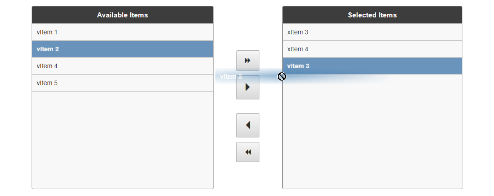

# Vue-Mover

A simple list picker vue-component, with drag and drop and sortable items.

> Note: this is a playground component as I'm experimenting and figuring out Vue. use at your own risk. [Feedback welcome](https://github.com/RickStrahl/vue-mover/issues).

* [Try it out](https://rawgit.com/RickStrahl/vue-mover/master/moverComponentSample.html)

Support:

* Moving items between two list displays
* Drag and drop or use movers
* Drag and drop sorting



### Syntax:
Inside of a Vue application use this markup:

```html
<script src="scripts/vue.min.js"></script>
<script src="scripts/Sortable.min.js"></script>    
<script src="vue-mover.js"></script>

<mover 
     target-id="MyMover"
     :left-items="selectedItems"
     :right-items="unselectedItems"
     titleLeft="Available Items"
     titleRight="Selected Items">
</mover>
```

where **left** and **right** items are array properties on the view model.

To set up the model load:

```
var vm = {
  pageTitle: "Vue Mover Component Sample",
  unselectedItems: [
    {
        value: "vitem1",
        displayValue: "vItem 1",
        isSelected: false
    },
    {
        value: "vitem2",
        displayValue: "vItem 2",
        isSelected: true
    },
    {
        value: "vitem3",
        displayValue: "vItem 3",
        isSelected: false
    },
    {
        value: "vitem4",
        displayValue: "vItem 4",
        isSelected: false
    },
    {
        value: "vitem5",
        displayValue: "vItem 5",
        isSelected: false
    }
  ],
  selectedItems: [
    {
        value: "xitem3",
        displayValue: "xItem 3",
        isSelected: false
    },
    {
        value: "xitem4",
        displayValue: "xItem 4",
        isSelected: false
    }
  ],    
  // demonstrate retrieving items
  saveItems: function() {
    var s = "";
    for (var i = 0; i < vm.selectedItems.length; i++) {
      var element = vm.selectedItems[i];
      s += element.displayValue + "\r\n";
    }

    alert('ready to save ' + vm.selectedItems.length + 
         ' items.\r\n' + s);
  }
} 

var app = new Vue({
      el: "#Body",
      data: function() { return vm; }
});
```

### Multiple Movers
You can drop multiple movers on the page. If you do be sure to give each mover a seperate `target-id` and a `group-name`:

```html
<mover :left-items="unselectedItems2" 
       :right-items="selectedItems2"
       target-id="Mover2"></mover>  
```

`targetId` is required for a second mover to ensure that each gets its own unique scope.

### Use without Font-Awesome
By default the mover uses Font-Awesome icons for the mover buttons. If you don't use Font Awesome in your app and you don't want to add it, you can turn off use of Font awesome with:

```html
<mover :font-awesome=false></mover>
```

Note the binding requirement (:) in front.

### Styling
You can override the styling of the various styles in the `vue-mover.css` style sheet. The mover overall should be self contained, but the height is probably one you'll want to adjust:

```html
<style>
    /* override panel height */
    #Mover .mover-panel {
        height: 500px;
    }
    #Mover2 .mover-panel {
        height: 300px;
    }
</style>
```

If you have multiple movers prefix your tags with the mover's target id to keep the CSS separate. The default ID is `Mover`.

### Dependencies

* [font-awesome](http://fontawesome.io)
* [sortable js](http://rubaxa.github.io/Sortable/)

### Build
Output is built with WebPack.

To build use:

```
npm run build
```
